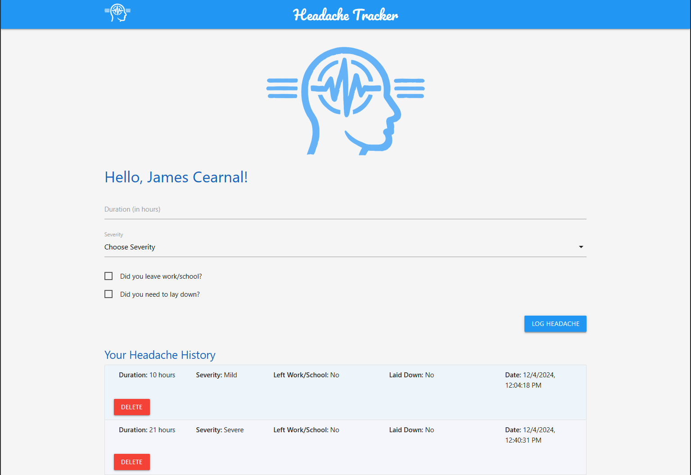
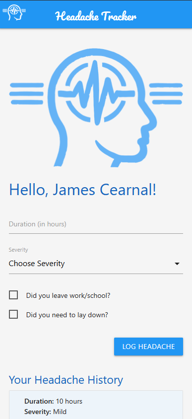

# Headache Tracker PWA

This Progressive Web App (PWA) prototype allows users to log and track their headaches, including details such as duration, severity, and whether they had to leave work or lay down. The app features offline functionality and installability for easy access and logging on mobile devices and desktops.

## Screenshots

### App Screenshot (Wide)

### App Screenshot (Narrow)

## Live Demo
You can view and install the app by navigating to the following URL:
`https://jcearnal.github.io/headache_tracker_pwa/`

## Features

- **Log Headaches**: Users can log headaches by entering details such as duration, severity, and other relevant information.
- **Headache History**: View a list of previously logged headaches with details such as date, severity, and actions taken.
- **Export and Print**: Users can export their headache history to CSV or print the log for personal records.
- **Installability**: The app can be installed on mobile and desktop devices like a native app.
- **Offline Access**: The PWA works offline, allowing users to log and view headache history even without an internet connection.

## PWA Functionality

This PWA is built using HTML, CSS (Materialize Framework), and JavaScript. It incorporates core PWA features, such as:

- **Service Worker**: 
  - A service worker is registered to enable offline access and caching of essential assets.
  - It implements a caching strategy to store resources like HTML, CSS, JavaScript, and images, ensuring that the app remains functional without an internet connection.
  - The service worker intercepts network requests and serves cached assets when offline, providing a smooth user experience.

- **Manifest**: 
  - The `manifest.json` file contains metadata about the app, allowing users to install it on their devices.
  - Key properties include:
    - **name**: The full name of the app, displayed on the user's home screen.
    - **short_name**: A shorter version of the name for the home screen icon.
    - **icons**: Specifies different sizes of icons for various devices, ensuring a responsive design.
    - **start_url**: Defines the starting point of the app when launched from the home screen.
    - **display**: Set to `standalone` to make the app look like a native application.

## How to Use

### Headache Log

- **Log a Headache**: 
  - Enter the duration of the headache (in hours).
  - Select the severity of the headache (Mild, Moderate, Severe).
  - Optionally check whether you left work/school or had to lay down.
  - Click the "Log Headache" button to save the entry.

### Headache History

- **View Past Entries**: The headache history section displays a list of past headache logs.
- **Pagination**: If there are more than 10 entries, you can navigate through pages using the pagination control.
- **Export to CSV**: Click the "Export to CSV" button to download your headache history in CSV format.
- **Print**: Click the "Print" button to print your headache history.

## Offline Mode

- **Caching**: The service worker caches important assets (HTML, CSS, JS, images) so the app remains accessible offline.
- **Usage**: Once loaded, the app can be used offline to view and log headaches. Logged data will be stored locally until an internet connection is available.

## Installation

1. Visit the app URL in a supported browser (Chrome, Edge, or Safari).
2. A prompt will appear to "Install" the app. Click the install button.
3. Once installed, you can launch the app from your home screen or desktop.

## Technology Stack

- **HTML**: Used for structuring the app content.
- **CSS (Materialize Framework)**: Used for styling the app and making it responsive.
- **JavaScript**: Handles the interactive functionality and service worker registration.
- **Service Worker**: Caches assets for offline use and intercepts network requests.
- **Manifest**: Provides metadata for the app and enables installability, making the app accessible from the home screen.

## Repository

You can find the full source code on GitHub:

`https://github.com/jcearnal/headache-tracker-pwa` 

The repository includes:

- **index.html**: Main structure of the app.
- **styles.css**: Custom styling for the app.
- **serviceworker.js**: Service worker file for caching assets and enabling offline functionality.
- **manifest.json**: App metadata for PWA functionality.
- **assets**: Icons and images used in the app.

## How to Run Locally

1. Clone the repository:  
   `git clone https://github.com/jcearnal/headache-tracker-pwa.git`
   
2. Navigate to the project directory:  
   `cd headache-tracker-pwa`
   
3. Open the `index.html` file in a browser to view and test the app.

4. Optionally, you can host the app on a local server (like Live Server in VS Code) to test installability and PWA features.
